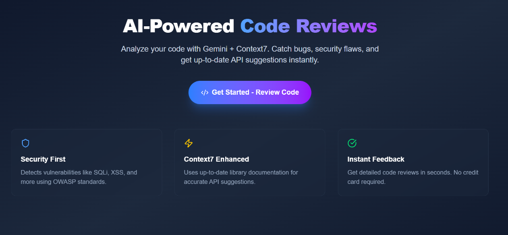
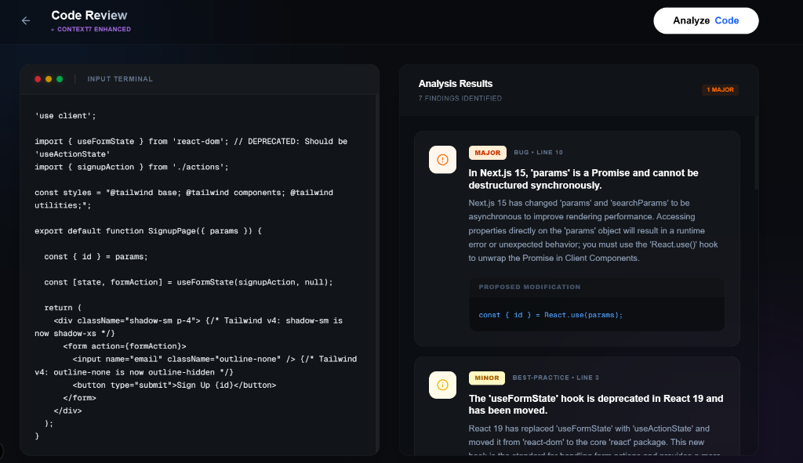

# Code Review Assistant

AI-powered code reviews with Gemini and Context7. Catch bugs, security flaws, and get up-to-date API suggestions instantly.

## 🚀 Why Code Review Assistant?

### The Context7 Advantage
Standard Large Language Models (LLMs) like ChatGPT or Gemini are incredibly powerful, but they have a "knowledge cutoff." This means they are often outdated when it comes to the latest documentation, breaking changes, and new API versions of libraries and frameworks.

**Code Review Assistant** bridges this gap by using **Context7**. We fetch live, up-to-date library documentation directly into the analysis phase, ensuring that your code reviews are accurate for the newest technical standards.

## ✨ Features

- **Gemini AI Analysis**: Deep code inspection for bugs, logic errors, and security vulnerabilities.
- **Context7 Enhanced**: Always-updated documentation awareness for 100+ libraries and frameworks.
- **Premium UI**: 
  - **Stylish Finding Cards**: Every issue is presented in a sleek, glassmorphism-style card.
  - **Clear Severity Levels**: Instant visualization of `Critical`, `Major`, `Minor`, and `Suggestion` issues.
  - **Interactive Fixes**: Get precise code suggestions that you can copy and implement immediately.
- **Standalone Mode**: Paste your code and get immediate results. No complicated setup required.

## 🛠️ Technologies

| Category | Technology |
|----------|------------|
| **Framework** | [Next.js 16](https://nextjs.org/) (App Router) |
| **Language** | [TypeScript 5](https://www.typescriptlang.org/) |
| **UI Library** | [React 19](https://react.dev/) |
| **Styling** | [Tailwind CSS 4](https://tailwindcss.com/) |
| **AI/LLM** | [Google Gemini](https://ai.google.dev/) via `@google/generative-ai` |
| **LLM Orchestration** | [LangChain](https://js.langchain.com/) |
| **Documentation** | [Context7](https://context7.com/) for live library docs |
| **State Management** | [TanStack Query](https://tanstack.com/query) (React Query) |
| **UI Components** | [Radix UI](https://www.radix-ui.com/), [Lucide Icons](https://lucide.dev/) |
| **Validation** | [Zod 4](https://zod.dev/) |
| **Notifications** | [Sonner](https://sonner.emilkowal.ski/) |
| **Code Diffs** | [diff2html](https://diff2html.xyz/) |

## 📋 Requirements

### Prerequisites
- **Node.js**: v18.18.0 or higher (required by Next.js 16)
- **npm**: v9.0.0 or higher (or yarn/pnpm)

### API Keys Required
| Key | Source | Purpose |
|-----|--------|---------|
| `GOOGLE_API_KEY` | [Google AI Studio](https://aistudio.google.com/apikey) | Powers Gemini AI code analysis |
| `CONTEXT7_API_KEY` | [Context7](https://context7.com/) | Fetches live library documentation |

## 📸 Screenshots

### Home Page


### Review Results & Stylish Finding Cards

*Demonstration of the analysis workspace and premium glassmorphism finding cards.*

## 🛠️ Getting Started

### 1. Install Dependencies

```bash
npm install
```

### 2. Configure Environment

Copy `env_example.txt` to `.env.local` and add your API keys:

```bash
cp env_example.txt .env.local
```

Then edit `.env.local`:
```env
GOOGLE_API_KEY=your_gemini_api_key_here
CONTEXT7_API_KEY=your_context7_api_key_here
```

### 3. Run Development Server

```bash
npm run dev
```

Open [http://localhost:3000](http://localhost:3000) in your browser.

### 4. Build for Production (Optional)

```bash
npm run build
npm start
```
